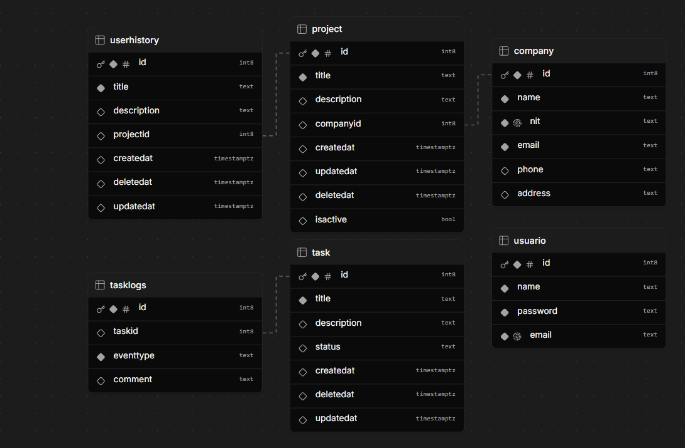

<p align="center">
  <a href="http://nestjs.com/" target="blank"></a>
</p>

[circleci-image]: https://img.shields.io/circleci/build/github/nestjs/nest/master?token=abc123def456
[circleci-url]: https://circleci.com/gh/nestjs/nest

  <!--[](https://opencollective.com/nest#backer)
  [](https://opencollective.com/nest#sponsor)-->

## Inicializar proyecto en local

```bash
  docker-compose up -d
```


## Ejecutar tests

```bash
# test coverage
$ npm run test:cov
```

## Consideraciones
<p>Un usuario solo puede estar adjunto a una compañia, es decir que al crear un nuevo usuario, en el formulario de registro,
Se debe seleccionar la compañia a la cual tiene acceso.

</p>


